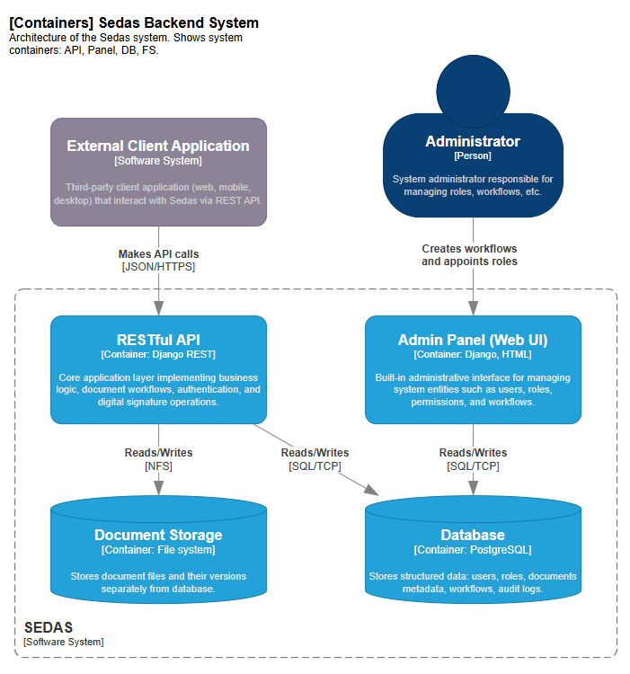
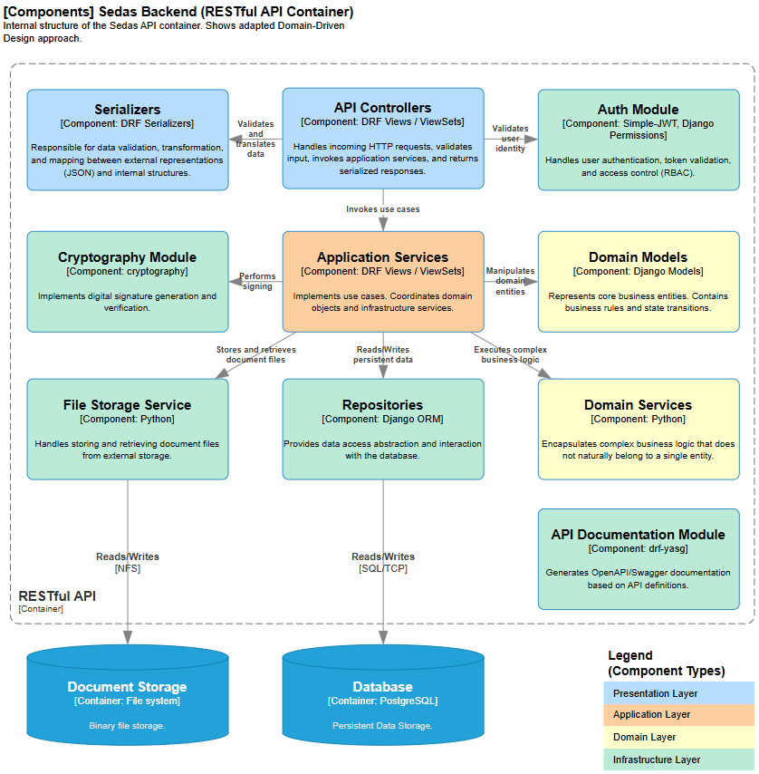
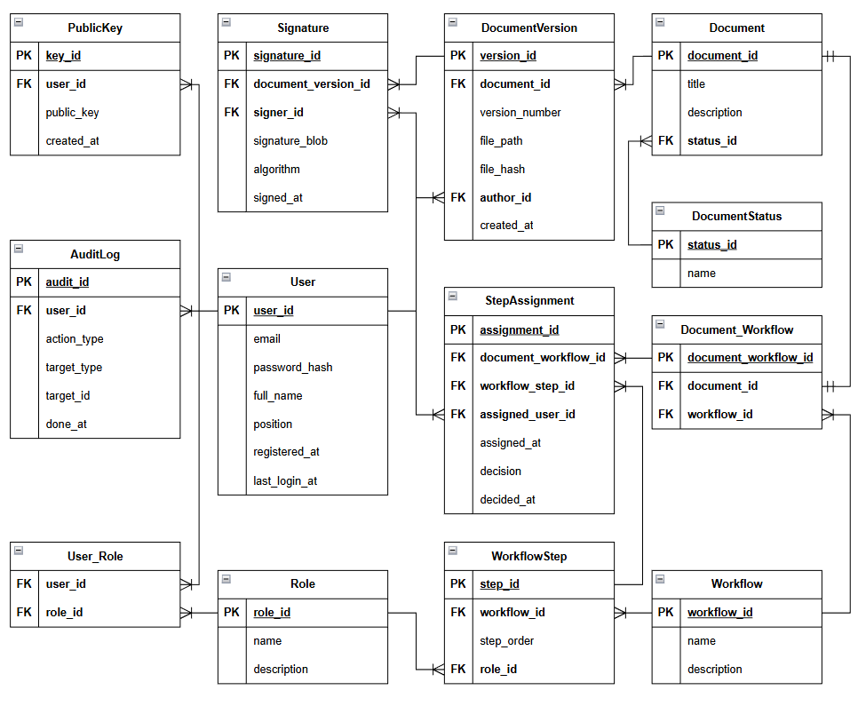

# Sedas

**Open-source API-first platform for electronic document management and digital signature**

[](https://python.org)
[](https://djangoproject.com)
[](https://www.django-rest-framework.org)
[](https://postgresql.org)
[](https://cryptography.io)
[](https://swagger.io)
[](https://docker.com)
[](LICENSE)

## About the Project

**Sedas** (System of Electronic Document Management and Signature) is an open-source server-side platform designed for full-cycle electronic document management with built-in support for digital signatures.

The project was created as a modern, flexible and transparent alternative to expensive closed-source commercial solutions. It is especially suitable for small and medium businesses, government organizations and development teams that need a customizable document workflow system.

### Key Features

- **API-first architecture** – all functionality is available through a well-documented REST API
- **Full OpenAPI/Swagger documentation** with Swagger UI and ReDoc
- **Digital signature support** (RSA-SHA256) using the `cryptography` library
- **Flexible configurable document workflows** (approval routes)
- **Document versioning** and complete audit trail of all actions
- **Role-Based Access Control (RBAC)**
- **Adapted Domain-Driven Design (DDD)** – clean architecture with clear layer separation
- **Client-independent** – works with any frontend, mobile app or third-party system
- **MIT License** – completely open and free for commercial use

---

## Tech Stack

- **Backend**: Python 3.11+, Django 5.2, Django REST Framework
- **Database**: PostgreSQL
- **Authentication**: JWT (djangorestframework-simplejwt)
- **Cryptography**: `cryptography` library
- **API Documentation**: drf-yasg (Swagger + ReDoc)
- **Deployment**: Docker + docker-compose + Nginx
- **Testing**: pytest + pytest-django

---

## Build & Run

Clone the repository:

```bash
git clone https://github.com/Honsage/Sedas.git
cd Sedas

cp .env.example .env
```

### 1. Using Docker (Recommended)

```bash
docker compose up -d --build
```

Admin credentials are specified in .env.

### 2. Local Development

Run the Postgres database on the `5432` port with connection parameters (db-name, user, password) from your .env file.

E.g. using docker:
```bash
docker run --name sedas-db -e POSTGRES_DB=sedas -e POSTGRES_USER=postgres -e POSTGRES_PASSWORD=postgres -p 5432:5432 -d postgres:16-alpine
```

Then activate python virtual environment, install dependencies, migrate the db, create superuser (admin) and run the dev server.

```bash
python -m venv venv
source venv/bin/activate    # Windows: venv\Scripts\activate

pip install -r requirements.txt
python manage.py migrate
python manage.py createsuperuser
python manage.py runserver
```

After startup:

* API: http://localhost/api/v1/
* Swagger UI: http://localhost/api/v1/swagger/
* ReDoc: http://localhost/api/v1/redoc/
* Django Admin: http://localhost/admin/

---

## Architecture
The project is built using Adapted Domain-Driven Design (DDD):

- Clear separation of concerns (domain, application, presentation, infrastructure)
- Business logic is encapsulated inside domain models
- Each business domain lives in its own Django app (users, documents, workflows, signatures, audit)
- Polymorphic audit logging for all important actions

Architecture is described with C4 and ER diagrams.

### C4 Containers Diagram



### C4 Components Diagram



### Entity-Relationship Diagram



---

## API Documentation
Interactive documentation is available after starting the project:

- Swagger UI: /api/v1/swagger/
- ReDoc: /api/v1/redoc/
- OpenAPI JSON: /api/v1/swagger.json

---

## Project Structure

```bash
Sedas/
├── LICENSE
├── README.md
├── docker-compose.yaml
├── nginx/                      # Nginx for static files
│   └── nginx.conf
└── backend/
    ├── Dockerfile
    ├── manage.py
    ├── requirements.txt
    ├── pytest.ini
    ├── config/                 # Django settings
    ├── apps/                   # Domain-based Django applications
    │   ├── users/
    │   ├── documents/
    │   ├── workflows/
    │   ├── signatures/
    │   └── audit/
    ├── infrastructure/         # Crypto utilities and shared code
    └── tests/
```

---

## Tests

Run `django-pytest` tests with:

```bash
pytest tests/
```

---

## License

This project is licensed under the MIT License – you are free to use, modify, and distribute it.

Contributions are welcome! Feel free to open issues and pull requests.
